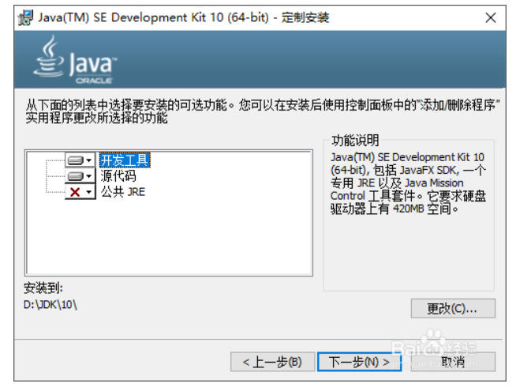

# win10 JDK安装

- 步骤1 安装包下载

[安装包下载路径](https://www.oracle.com/technetwork/java/javase/downloads/index.html)

- 步骤2 安装软件

  因为JDK包含了JRE，所以JRE不用再单独安装

  

- 步骤3 设置环境变量

  ​	打开环境变量编辑界面，在系统变量里，新建变量JAVA_HOME,其值设置为JDK的安装目录，如D:\JDK\10

  然后在Path变量中，增加%JAVA_HOME%\bin，并让该变量处于第一位置。

- 步骤4 检查是否已安装好

  ​	快捷键WIN+R，CMD，进入C盘，输入java -version查看当前JAVA版本，输入where java查看java的来源。