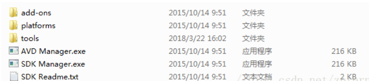
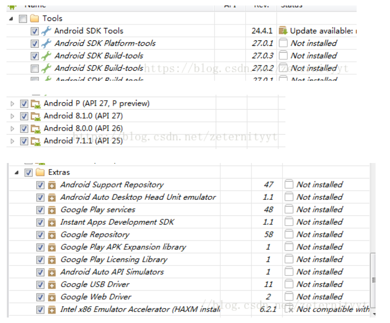

# win10 SDK 安装

- 步骤一 安装包下载zip包，sdk_r24

  [官网需翻墙](https://developer.android.com/studio/index.html)

  [无需翻墙](http://www.androiddevtools.cn/)

- 步骤二 安装软件

  在需要安装的位置解压zip包，得到如下

  

  打开SDK Manager.exe，在以下界面中选择

  

  点击install

- 步骤三 设置环境变量

  ​	打开环境变量编辑界面，在系统变量里，新建变量ANDROID_SDK_HOME,其值设置为SDK的安装目录，如D:\android\SDK

  ​	然后在Path变量中，增加%ANDROID_SDK_HOME%;%ANDROID_SDK_HOME%\platform-tools;%ANDROID_SDK_HOME%\tools.

- 步骤四 检查是否安装好

  ​	快捷键WIN+R，CMD，进入C盘，输入android会得到打开SDK Manager.exe后相同的界面，输入adb,可看到adb.exe的路径，在SDK的%ANDROID_SDK_HOME%\platform-tools下面。

